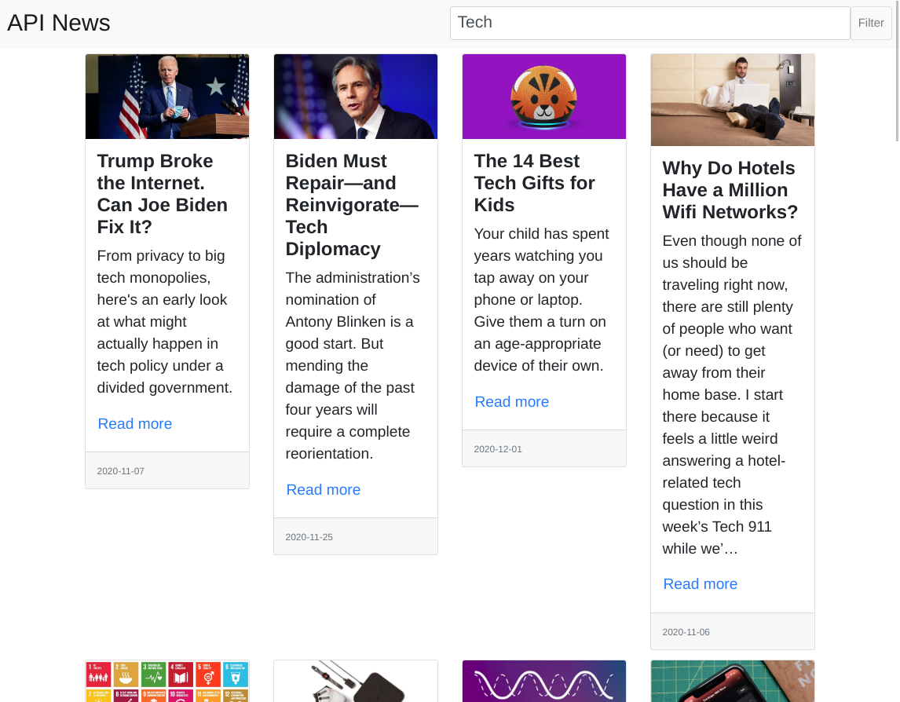
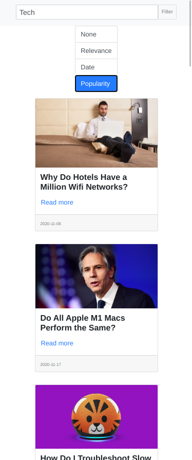

# General description - API News

It’s a news search app using [NewsAPI](https://newsapi.org/). It's a static application with HTML5, CSS3 and TypeScript(React). The next features are present:

- Search for articles (in language 'en') by a search string.
- Search results show the image, title, publish date, description and the url with a 'Read More' button.
- Search results are sortable by either of the following criterias - date, relevance, popularity or none.
- Clicking the image or the 'Read More' button will open the article in a new tab
- It's mobile responsive (mobile first)! It shows articles in a single column and hide the article description for mobile devices.


## Searching in Mobile


## Searching in Desktop


## Sorting in Mobile



# Run React Project
As simple as run the following command
```
npm i
npm start
```

## Proposed improvements (not necessarily for performance)

- Create testing units (just to ensure that everything is running OK)
- Avoid unnecesary render (useMemo/memoRef/useCallback)
- Read error in evenry call to the API
- Change fetch for AXIOS
- Add pagination
- update URL for improvements in search

## Author
Carlos Mendez - @cjairm

### Created on December 5th, 2020 
